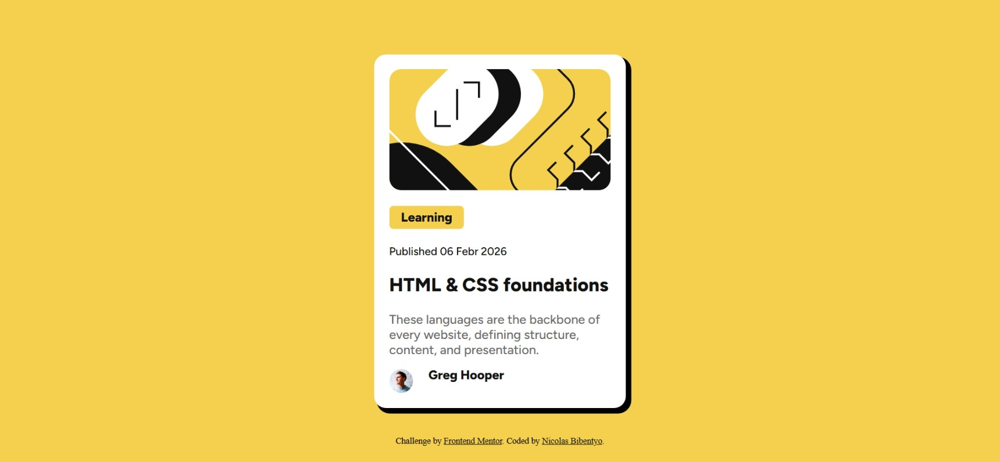

# Frontend Mentor - blog-preview

## Table of contents

- [Overview](#overview)
  - [Screenshot](#screenshot)
  - [Links](#links)
- [My process](#my-process)
  - [Built with](#built-with)
 

## Overview

This is my solution to the [Blog preview challenge on Frontend Mentor](https://www.frontendmentor.io/challenges/social-links-profile-UG32l9m6dQ). Frontend Mentor challenges help me improve my coding skills by building realistic projects. 

### Screenshot

### Links

- Solution URL: (https://github.com/Nicolas-Ohlin/blog-preview.git)
- Live Site URL: (https://nicolas-ohlin.github.io/blog-preview/)

## My process
-Analyse the page
-Extract the HTML structure
-Write HTML first
-Style the page with css
-Debug with AI (copilot)

### Built with

- Semantic HTML5 markup
- Pure CSS 
- Flexbox

## Author
- Frontend Mentor - [@Nicolas-Ohlin](https://www.frontendmentor.io/profile/Nicolas-Ohlin)

